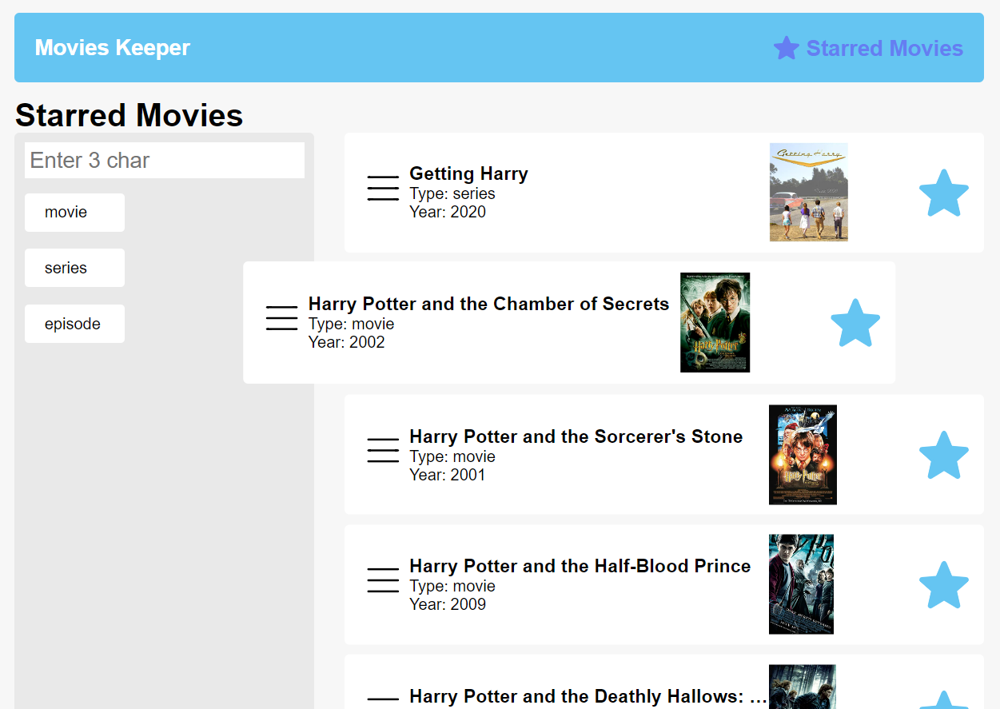

# Movies keeper

This single page application allows you to work with OMDb API. You can search through the movies database, get detailed information about particular movie and create your favorite list.

## Credentials

The app is based on the open API http://www.omdbapi.com/  
Create .env file with the valid API_KEY variable to get access to the OMDb.

## Available Scripts

Run development environment:

```
$ yarn start
```

and get acces to the app on http://localhost:3000/

Build for production:

```
$ yarn build
```

# Features

### Home Page

Here you can search through the OMDb API by movie's name and use movie/series/episode quick filters.


By clicking on the list item you can get the detailed information about the particular movie.


There is also pagination and "add to favorite" functionality.

### Favorites Page

The page shows you favorites list. You can sort movies by drag-and-drop or remove movie from the list.



## Tech Stack & Technologies

- React
- RxJS
- TS
- Webpack
